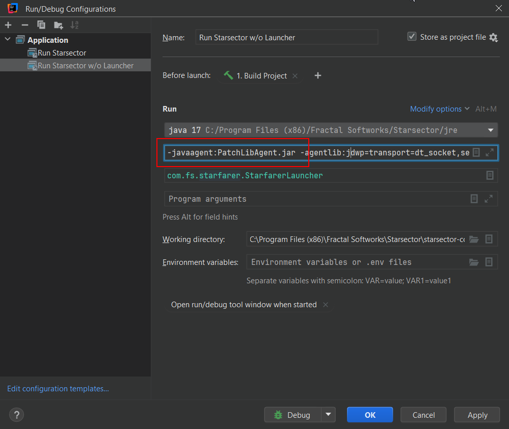

# PatchLib

A Starsector mod that enables patching code at runtime.  
This can be used to modify the behaviour and values from vanilla methods.

# 1. Installation

The mod requires some special setup. However, it comes bundled with an installer that starts when you start the game with the mod enabled.
As such most people should be fine to just start the game and follow the instructions there and install it like any other mod otherwise.
There are some cases that need special treatment below though.

### 1.1 Manual Installation

The manuall install involves to steps. First you copy `PatchLibAgent.jar` from the mods `/jars` folder next to the games launcher, and then you add `-javaagent:PatchLibAgent.jar` to the launch arguments, right after `-noverify`. Where exactly depends on your platform:

- **Windows:** Copy the jar into `starsector-core`, then add the flag to `vmparams` (in the game root, next to the exe).
- **Linux:** Copy the jar into the game root, next to `starsector.sh`, then add the flag to `starsector.sh` as its own continuation line after `-noverify`.
- **Mac:** Copy the jar into `Starsector.app/Contents/Resources/Java`, then add the flag to `Contents/MacOS/starsector_mac.sh`.

> **Warning:** The jar and the flag go together. If you remove `PatchLibAgent.jar` but leave the `-javaagent` flag in your launcher, the game wont start at all, since the JVM cant find the agent it was told to load. When uninstalling, remove both.

### 1.2 Fast Rendering

Currently incompatible until the next Fast Rendering update.

### 1.3 IntelliJ Mod Template

If you are a mod author and your mod is set up with [Wisps IntelliJ template](https://github.com/wispborne/Starsector-IntelliJ-Template), then it requires some manual installation. If you are using the Template from [Galatia Academy](https://galatia-academy.dev/wiki/mod-setup) then you can ignore this section. 
The issue is that wisps template has the vmparams for booting the game included in its run configurations, so if you make use of those, they will be missing the -javagent flag.
So either:

- Add `-javaagent:PatchLibAgent.jar` to the VM options of your run config yourself or
- Download the two premade run configs below and drop them into your mods `.run` folder.

-> [Run Starsector (PatchLib)](https://github.com/Lukas22041/PatchLib/blob/master/readme/Run%20Starsector_PatchLib.run.xml)  
-> [Run Starsector w/o Launcher (PatchLib)](https://github.com/Lukas22041/PatchLib/blob/master/readme/Run_Starsector_w_o_Launcher_PatchLib.run.xml)



Either way the agent jar still needs to sit in `starsector-core`, the same as the manual install above, but the installer will have also done this already for you.

> If you do not do this step, the the run configurations will repeatedly start the installer, instead of actually starting the game.

# 2. Guide for mod authors 

Full documentation is on the [wiki](https://github.com/Lukas22041/PatchLib/wiki).

As a quick example, a patch is just a class marked with `@Patch` that points at a target, with static methods marked `@Before` or `@After` that hook into it. 
This allows you to modify starsector code in many ways:

- Run code before or after starsector methods
- Replace or modify the return value of a method
- Replace or modify the arguments that a method receives
- Skip a method and run your own code instead

Following is an example patch. This patch is run after every "getCycle" call on starsectors campaign clock, and changes the value to be 1000 higher than its actual value.

```java
@Patch(target = @ClassMatch(subType = CampaignClockAPI.class))
public class TestPatch {

    @After(target = @MethodMatch(methodName = "getCycle"))
    public static void afterGetCycle(AfterContext context) {
        context.setReturnValue((int) context.getReturnValue() + 1000);
    }

}
```

`@Patch` picks the class to patch, here anything implementing `CampaignClockAPI`. `@After` runs after `getCycle` returns, and `PatchContext` lets you read and overwrite the return value.
PatchLib automatically scans for the @Patch annotation, so you can leave your patches in whichever folder you want.

To make use of PatchLib in your mod, you want to add "PatchLibAPI.jar" from the `/jars` as a code dependency.
Do not add any of the other jars as a dependency. More instruction can be found in the [wiki](https://github.com/Lukas22041/PatchLib/wiki).

# 3. Performance

There are two types of performance impacts from the library. 

### 3.1 Installation Performance

The first one is on-install performance. 
This one occurs whenever a class gets first loaded and patchlib has to decide which patches may apply, and then has to apply them. 
This one can create stutter if something causes to many classes to be load at once, and if there are patches that apply very widely to many classes at once.

To mitigate this issue, PatchLib loads all base starsector classes (api & obf) during game load instead, 
extending load by around 1-2 seconds on average, but preventing micro stutter in the campaign and combat, especially when opening UI menus.
It preloads them without calling their static initializers. 

Modded classes are currently not preloaded, so very broad patches (those that target hundreds or thousands of classes) could likely create some stutter in heavily modded games.

### 3.2 Runtime Performance

Patches inherently add to the performance cost of the method they are patching. 
This applies even if your patch handler is empty, without any code. The structures that have to be inserted in to the method to make the patch work have a cost to them.

PatchLib's own performance test uses the method below to test the baseline cost:

```java
public long baseline(int seed) {
    int acc = seed;
    for (int i = 0; i < 16; i++) acc = acc * 31 + i;
    StringBuilder sb = new StringBuilder(16);
    sb.append("v").append(acc & 0xFF);
    acc += helperInstance(acc); 
    acc += helperStatic(acc); 
    TestBox box = new TestBox(acc); 
    lastValue = acc; 
    long read = lastValue; 
    return read + box.value + sb.length(); 
}
```

The test calls the method thousands of times, each time with a different patch applied, to get the result below.
Every patch is an empty patch, i.e it only installs the necessary code to make the Patch work, no actual change occurs.

```
baseline (unpatched):          best 11 ns/call,   avg 14 ns/call
@Before:                       best 23 ns/call,   avg 32 ns/call 
@After:                        best 25 ns/call,   avg 34 ns/call
@Except:                       best 20 ns/call,   avg 29 ns/call
@RedirectCall:                 best 29 ns/call,   avg 43 ns/call
@RedirectNew:                  best 27 ns/call,   avg 44 ns/call
@RedirectFieldRead:            best 29 ns/call,   avg 45 ns/call
@RedirectFieldWrite:           best 31 ns/call,   avg 47 ns/call
@Before + @After:              best 28 ns/call,   avg 39 ns/call
@Before + @After + @Except:    best 28 ns/call,   avg 36 ns/call
```

As you can see, most patches are at the least twice the call cost. 
However, keep in mind that this cost is not dependent on the patched methods own execution time, its just a flat addition that doesnt scale.

For methods that perform more complex work, you may not feel much of a difference, 
for methods that barely even did anything before you patched them, it will make them much more costly, relatively.

That said though, in most cases this wont be much of an impact. Individual nanoseconds are usually far from worth noting. 
Where it is worth taking into account is methods that are called on each frame for thousands of objects at a time. 

### 3.3 Improvements

There are potential performance improvements that could drop in the future, like by code generating final static method handles to the handler sites, so that the Just-in-Time compiler can inline them, but
for keeping the library more simple internally, those are left out for now.